## Proyecto Microarquitecturas y Softcores

- Autor: Gonzalo G. Fernandez
- Carrera de Especializacion en Sistemas Embebidos
- Laboratorio de Sistemas Embebidos - FIUBA

## Desarrollo de IP cores para robot movil en plataforma Zynq7

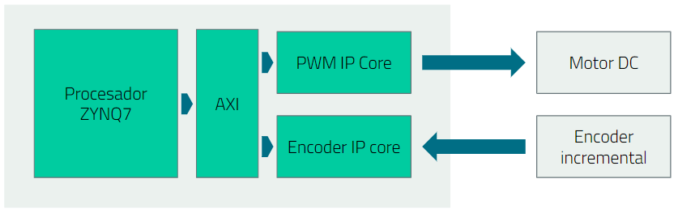

### PWM IP core: diseño y simulación comportamental

El comportamiento se basa en el siguiente diagrama de tiempo:

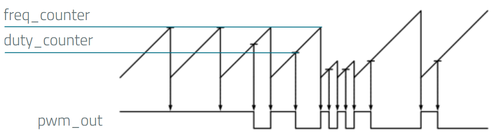

La salida queda definida por:
- *freq_counte*: define la frecuencia del canal PWM
- *duty_counter*: define el duty cycle del canal PWM

El diagrama de bloques del modulo diseñado es el siguiente:

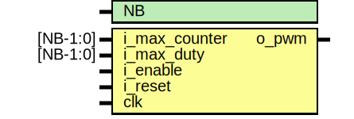

Simulacion comportamental:

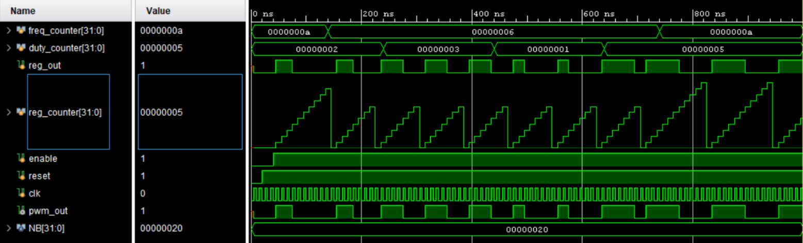

### Diagrama de bloques

Project block design (PWM y switches):

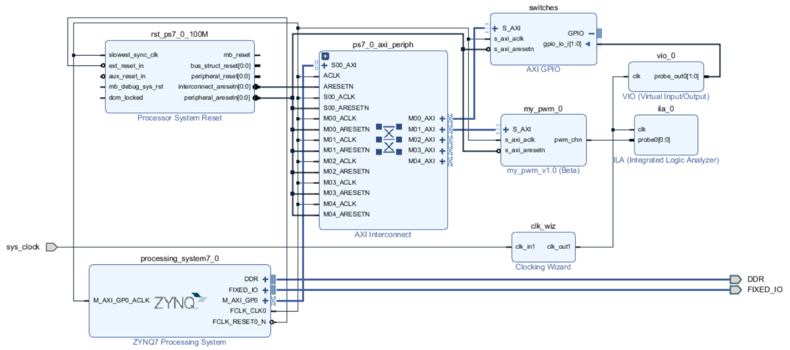

Project block design (PWM, encoder y switches):

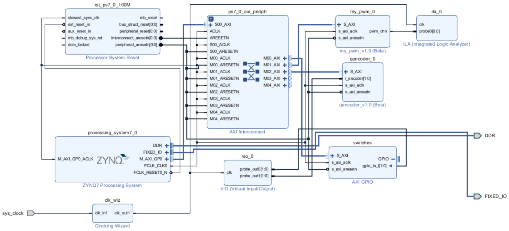

### Implementacion

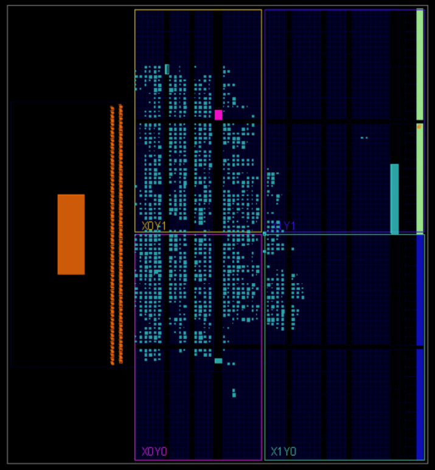

Timing report:

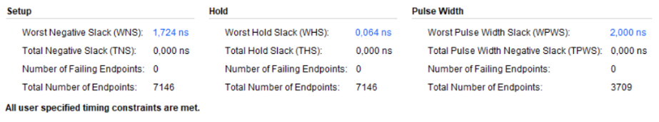

Utilization report:

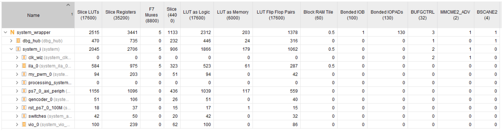

Power report:

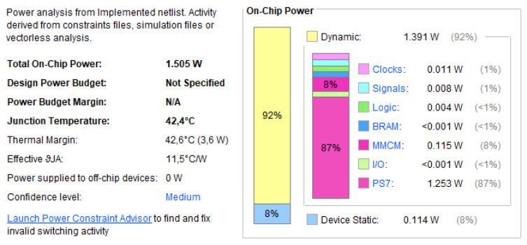

### Propuesta a futuro

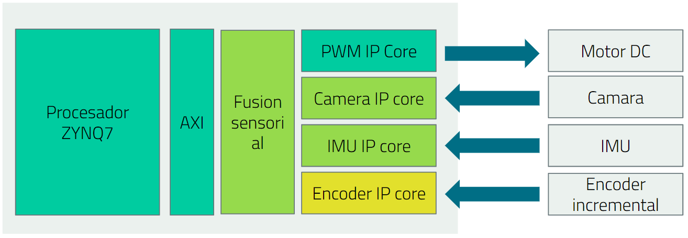